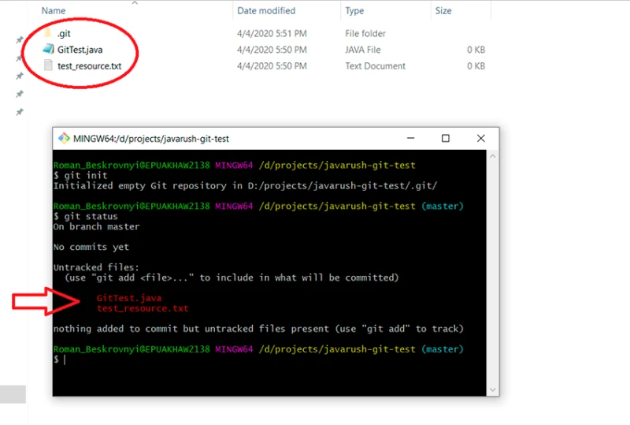

# **Git краткое руководство**

## Основы

Git - это набор консольных утилит, которые отслеживают и фиксируют изменения в файлах (чаще в исходном коде программ). 
Изначально Git был создан Линусом Торвальдсом при разработке ядра Linux.
Git нужен,  чтобы отследить изменения, произошедшие с проектом во времени. Он также чрезвычайно полезен при одновременной работе над одним проектом.

## Установка

Linux 

`sudo apt-get install git`

Windows 

`git для windows `

OS X 

`brew install git`

## Настройка

После установки git, нужно добавить несколько настроек. 

`git config --global user.name "My Name"`

`git config --global user.email myEmail@example.com`

Если есть необходимость, для конкретного проекта поменять автора, нужно убрать флаг --global. Настройка будет действовать только для текущего проекта.

таким образом все будут знать кто, где и когда нагадил.
Впрочем, если вы укажите фиктивные данные - это вас не спасёт. 
Честность - форева. 

Все настройки системы

`git config --list`

`git --help `

Общая документация по git

`log --help`

хелп по команде (в данном случае это - log)

Если вы вдруг сделали очепятку - система подскажет вам нужную команду
После выполнения любой команды - отчитается о том, что вы натворили
Также Гит прогнозирует дальнейшие варианты развития событий и всегда направит разработчика, не знающего, куда двигаться дальше

## Создание нового репозитория

`git init`

Initialized empty Git repository in /home/user/Desktop/git_exercise/.git/

Репозиторий был успешно создан, но пока что пуст. 

После этого будет создана папка .git в текущей папке терминала.

.git — это папка, которая хранит всю информацию о гит репозитории. Если ее удалять, то будет утеряна вся информация о репозитарии. Следовательно, вся история изменений и вся остальная информация git`a.

## Определение состояния

`git status`

Очень важная команда. Позволяет понять где и в каком состоянии вы находитесь.

Состояния файлов:
* неотслеживаемое (untracked);
* измененное (modified);
* подготовленное (staged);
* закомиченное (committed).

## Подготовка файлов

`git add hello.txt`

Добавить файл в отслеживание

`git add -a` или `git add .` 

Добавить в отслеживание все файлы в папке

`git add *.md`

Здесь можно пользоваться регулярными выражениями, чтобы добавлять по какому-то шаблону.

`git diff .\Git_quickguide.md`

Посмотреть изменения

`git reset`
`git reset css/style.css`

изъять ошибочный файл

## Фиксация изменений

`git commit -m 'Add some code'`

Флаг -m это комментарий разработчика. Он необходим для описания зафиксированных изменений. 

## Просмотр коммитов

`git log`

информация о каждом отдельном коммите, с указанием его хэша, автора, списка изменений и даты, когда они были сделаны. Отследить интересующие вас операции в списке изменений, можно по хэшу коммита, при помощи команды git show :

g`it log --oneline`

вывод информации о каждом коммите в одну строку с указанием его хэша и комментария. 

`git show hash_commit`

Ну а если вдруг нам нужно переделать commit message и внести туда новый комментарий, можно написать следующую конструкцию:

<<<<<<< HEAD
`git commit --amend -m 'Новый комментарий'`

В данном случае сообщение последнего коммита перезапишется. Но злоупотреблять этим не стоит, поскольку эта операция опасная и лучше ее делать до отправки коммита на сервер.

## Работа с .gitignore

Если мы хотим хранить в репозитории только исходный код и ничего другого надо создать в корневой папке рабочей области специальный файл .gitignore. В этом файле каждая строка будет шаблоном для игнорирования.

Например:

800.webp

*.jpg

*.webp

## Работа с ветками

`git branch -a`

Список всех веток в репозитории 

`git checkout -b dev 1fa3afc`

Создание ветки dev на основе коммита 1fa3afc

## Слияние веток и разрешение конфликтов

`git merge dev`

Слияние текущей ветки с dev. Ветка dev вливается в текущую (в нашем случае - в master)

Конфликт 1
=======
git commit --amend -m 'Новый комментарий'
В данном случае сообщение последнего коммита перезапишется. Но злоупотреблять этим не стоит, поскольку эта операция опасная и лучше ее делать до отправки коммита на сервер.

Конфликт 2
>>>>>>> dev
